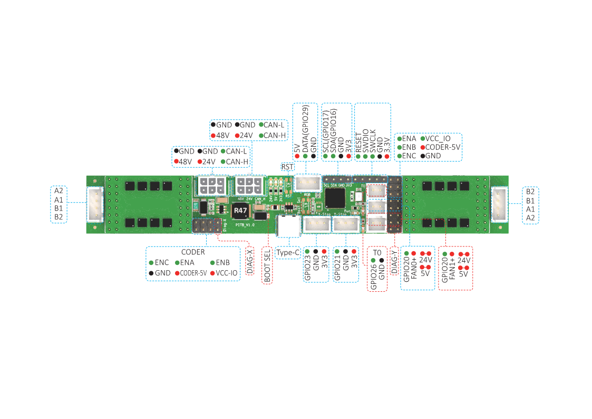
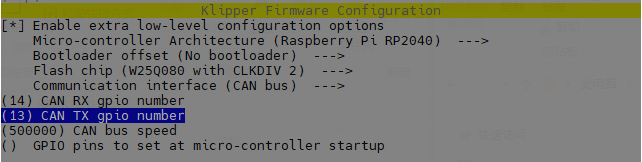

## FYSETC PITB

### 1. Product introduction

Thanks for the great effort of the PCB designers [DFH](https://github.com/deepfriedheroin), [Armchair-Engineering](https://github.com/Armchair-Engineering) and the other members from community to make this come true.

### 2. Hardware guide

#### 2.1 pinout

<table>
   <tr><td>Features</td><td>PITB Pin</td><td>RP2040 Pin</td><td>Pin No.</td><td>Comment</td></tr>
   <tr><td rowspan="4">X-MOTOR(1)</td><td>X-Step</td><td>GPIO8</td><td>11</td><td></td></tr>
   <tr><td>X-DIR</td><td>GPIO7</td><td>9</td><td></td></tr>
   <tr><td>X-EN</td><td>GPIO5</td><td>7</td><td></td></tr>
   <tr><td>X-CS/PDN</td><td>GPIO6</td><td>8</td><td></td></tr>
   <tr><td rowspan="4">Y-MOTOR(2)</td><td>Y-Step</td><td>GPIO12</td><td>15</td><td></td></tr>
   <tr><td>Y-DIR</td><td>GPIO11</td><td>14</td><td></td></tr>
   <tr><td>Y-EN</td><td>GPIO9</td><td>12</td><td></td></tr>
   <tr><td>Y-CS/PDN</td><td>GPIO10</td><td>13</td><td></td></tr>
   <tr><td rowspan="3">TMC Driver SPI </td><td>MOSI</td><td>GPIO3</td><td>5</td><td></td></tr>
   <tr><td>MISO</td><td>GPIO0</td><td>2</td><td></td></tr>
   <tr><td>SCK</td><td>GPIO2</td><td>4</td><td></td></tr>
   <tr><td rowspan="2">End-stops</td><td>X-STOP</td><td>GPIO23</td><td>35</td><td>Jumper connection for X-DIAG</td></tr>
   <tr><td>Y-STOP</td><td>GPIO24</td><td>36</td><td>Jumper connection for Y-DIAG</td></tr>
   <tr><td rowspan="3">FAN/RGB</td><td>FAN0</td><td>GPIO20</td><td>31</td><td></td></tr>
   </td><td>FAN1</td><td>GPIO21</td><td>32</td><td></td></tr>
   </td><td>RGB</td><td>GPIO29</td><td>41</td><td></td></tr>
   <tr><td rowspan="1">Temperature</td><td>TE0（THERM0）</td><td>GPIO26</td><td>38</td><td>A 4.7kOhm 0.1% temperature sensor pull up resistor is used,PT1000 can be connected directly. For PT100, an amplifier board must be used.</td></tr>
   <tr><td rowspan="2">CAN</td><td>TX</td><td>GPIO13</td><td>16</td><td></td></tr>
   <tr><td>RX</td><td>GPIO14</td><td>17</td><td></td></tr>
   <tr><td rowspan="2">EEPROM I2C Pin-Out</td><td>SCL</td><td>GPIO17</td><td>28</td><td></td></tr>
   <tr><td>SDA</td><td>GPIO16</td><td>27</td><td></td></tr>
   <tr><td rowspan="3">SWD Debug</td><td>SWDIO</td><td>SWDIO</td><td>25</td><td>only used for debugging now and can be used for other purposes.</td></tr>
   <tr><td>SWCLK</td><td>SWCLK</td><td>24</td><td>only used for debugging now and can be used for other purposes.</td></tr>
   </td><td>RESET</td><td>#RUN</td><td>26</td><td></td></tr>
</table>

## Firmware

