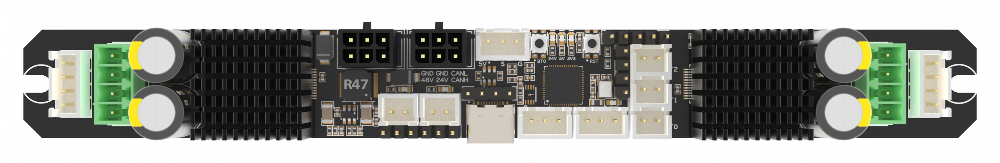
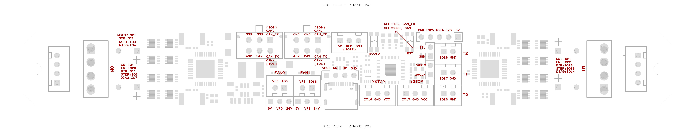

## PITB V2.0

### 1. Product introduction

The PITB (Party in the Back) is a high performance dual motor controller board for Klipper and RRF 3D printers.
This design was made possible by the joint efforts of [DFH](https://github.com/deepfriedheroin), [Armchair-Engineering](https://github.com/Armchair-Engineering), [kageurufu](Https://GitHub.com/kageurufu) and many other community members to make this come true.

## Features

1. Dual 6.0A MAX onboard TMC5160 Drivers with heatsink
2. RP2040 133Mhz 32 Bit microcontroller
3. CANBUS CANFD based on MCP2518
4. 12V5V/3.3V DC-DC Convertor
5. Klipper & RRF Firmware Support

### 2. Hardware guide

#### 2.1 pinout

## Firmware
