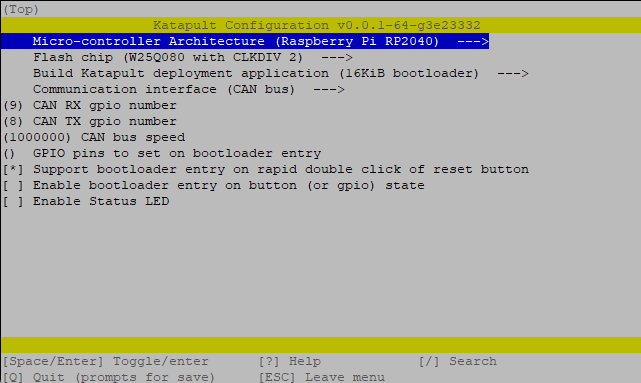

## PITB V2.0

## 1. Product introduction

Thanks for the great effort of the PCB designers [DFH](https://github.com/deepfriedheroin), [Armchair-Engineering](https://github.com/Armchair-Engineering), [kageurufu](Https://GitHub.com/kageurufu) and the other members from community to make this come true.

## Features

1. Dual 6.0A MAX onboard TMC5160 Drivers with heatsink
2. RP2040 133Mhz 32 Bit microcontroller
3. CANBUS CANFD based on MCP2518
4. 12V5V/3.3V DC-DC Convertor
5. Klipper & RRF Firmware Support

RP2040 Microprocessor 
TMC5160 Drivers, using FYSETC's BIG5160 modules for up to 60V 6A per stepper 
Two fan control connectors, either 5V or 24V selectable 
3 Thermistor connector, for reading temperatures 
Two endstop connectors, 3.3V logic level 
Neopixel RGB connectors 
I2C connector for smart peripherals (displays, sensors, and more) 

## 2. Hardware guide

### 2.1 pinout

<table>
   <tr><td>Features</td><td>PITB Pin</td><td>RP2040 Pin</td><td>Comment</td></tr>
   <tr><td rowspan="5">X-MOTOR(1)</td><td>X-Step</td><td>GPIO6</td><td></td></tr>
   <tr><td>X-DIR</td><td>GPIO5</td><td></td></tr>
   <tr><td>X-EN</td><td>GPIO20</td><td></td></tr>
   <tr><td>X-CS/PDN</td><td>GPIO1</td><td></td></tr>
   <tr><td>X-DIAG</td><td>GPIO7</td><td></td></tr>
   <tr><td rowspan="5">Y-MOTOR(2)</td><td>X-Step</td><td>GPIO13</td><td></td></tr>
   <tr><td>Y-DIR</td><td>GPIO23</td><td></td></tr>
   <tr><td>Y-EN</td><td>GPIO22</td><td></td></tr>
   <tr><td>Y-CS/PDN</td><td>GPIO21</td><td></td></tr>
   <tr><td>Y-DIAG</td><td>GPIO14</td><td></td></tr>
   <tr><td rowspan="3">TMC Driver SPI </td><td>MOSI</td><td>GPIO3</td><td></td></tr>
   <tr><td>MISO</td><td>GPIO4</td><td></td></tr>
   <tr><td>SCK</td><td>GPIO2</td><td></td></tr>
   <tr><td rowspan="2">End-stops</td><td>X-STOP</td><td>GPIO16</td><td></td></tr>
   <tr><td>Y-STOP</td><td>GPIO17</td><td></td></tr>
   <tr><td rowspan="3">FAN/RGB</td><td>FAN0</td><td>GPIO0</td><td></td></tr>
   </td><td>FAN1</td><td>GPIO18</td><td></td></tr>
   </td><td>RGB</td><td>GPIO19</td><td></td></tr>
   <tr><td rowspan="3">Temperature</td><td>T0（THERM0）</td><td>GPIO26</td><td>A 4.7kOhm 0.1% temperature sensor pull up resistor is used,PT1000 can be connected directly. For PT100, an amplifier board must be used.</td></tr>
   <td>T1（THERM1）</td><td>GPIO27</td><td>A 4.7kOhm 0.1% temperature sensor pull up resistor is used,PT1000 can be connected directly. For PT100, an amplifier board must be used.</td></tr>
   <td>T2（THERM2）</td><td>GPIO28</td><td>A 4.7kOhm 0.1% temperature sensor pull up resistor is used,PT1000 can be connected directly. For PT100, an amplifier board must be used.</td></tr>
   <tr><td rowspan="2">CAN</td><td>TX</td><td>GPIO8</td><td></td></tr>
   <tr><td>RX</td><td>GPIO9</td><td></td></tr>
   <tr><td rowspan="3">SSD1306 Display/BME280/EEPROM I2C Pin-Out</td><td>SCL</td><td>GPIO25</td><td></td></tr>
   <tr><td>SDA</td><td>GPIO24</td><td></td></tr>
   <tr><td>i2C Bus</td><td>i2c0g</td><td></td></tr>
   <tr><td rowspan="3">SWD Debug</td><td>SWDIO</td><td>SWDIO</td><td>only used for debugging now and can be used for other purposes.</td></tr>
   <tr><td>SWCLK</td><td>SWCLK</td><td>only used for debugging now and can be used for other purposes.</td></tr>
   </td><td>RESET</td><td>#RUN</td><td></td></tr>
</table>

### 2.2 Klipper and Canbus
At this time klipper only supports CAN not CAN FD, The jumper must be fitted between SEL and GND.

## 3 Firmware
### 3.1 Canboot/Katapult
cd ~/CanBoot/ 
make menuconfig 

make clean 
make -j 4 
reboot into bootloader mode 
sudo make flash FLASH_DEVICE=2e8a:0003 
~/klippy-env/bin/python ~/klipper/scripts/canbus_query.py can0 
This should show a canboot device for you PITB the UUID is needed for klipper config and to flash the firmware 
 
### 3.2 Klipper Firmware
mkdir ~/printer_data/config/firmware 
cd ~/klipper 
#backup existying config for your current MCU 
cp -f ~/klipper/.config ~/printer_data/config/firmware/MCU.config 
make menuconfig 

#backup config for PITB klipper firmware 
cp -f ~/klipper/.config ~/printer_data/config/firmware/pitb.config 
make clean 
make -j 4 
python3 ~/CanBoot/scripts/flash_can.py -i can0 -f ~/klipper/out/klipper.bin -u XXXXXXXXXXX 
 

## 4 Klipper Config
<a href="PITB.cfg">PITB.cfg</a> 
<a href="sensorless_homing.cfg">sensorless_homing.cfg</a> 
